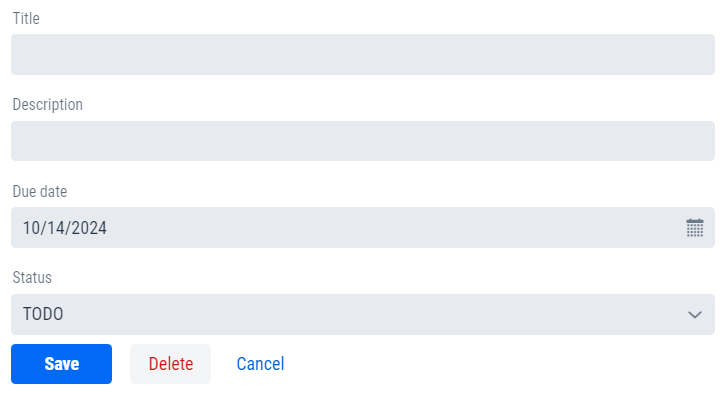

# Vaadin coding exercise: Simple Task Manager

## Prerequisites
VSCode\
Extension Pack for Java\
Spring Boot Extension Pack (Optional)

## Exercise
### How to run and develop from a container
1. Clone this repository on your machine.
2. Go to vaadin_exercise directory (cd vaadin_exercise).
3. Open Docker Desktop.
4. Run docker-compose up --build and wait for the build process to finalize.
5. After building is finished you will have a Vaadin project running with Springboot hot reload.

### Coding steps
1. Start from data\Task.java and create the parameters and constructor for each task.
2. Move to views\TaskForm.java and create all the fields for the task creating form.
3. Finally move to views\MainView.java and configure the grid. You should have cleared all errors by now and the application should run as expected.
#### Form Example

